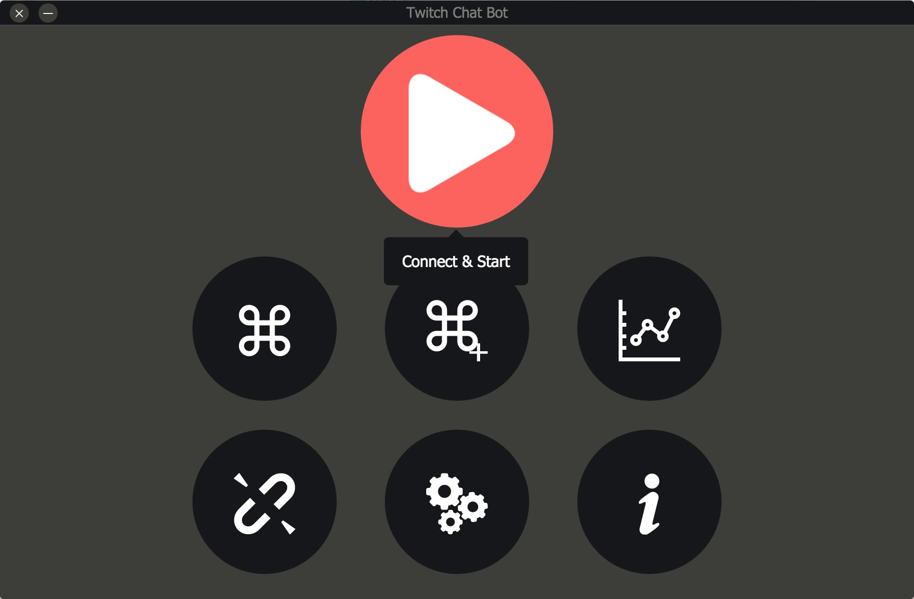

Twitch Chat Bot
===============

Twitch IRC Bot for Chat, written in Javascript with Electron.

It is a simple Twitch chat bot. Bot instructions will be provided soon.

**This project is under development right now. Not recommended for end user! If you want to help the project feel free to fork it. PR's are welcomed!**

## Screenshot

## Prerequisites

* Node.js
* Electron

## Used Libraries

* node-irc
* jQuery

Building
========

* Clone the Git repository.
* If you're not installed Node.js and Electron yet, you can download Node.js from [here](https://nodejs.org/) and then you can download electron prebuilt library from npm with `npm install electron-prebuilt -g` command.
* Open your terminal again and in your project folder, for to download third party libraries, run `npm install`.
* Run `electron index.js` or `npm run`.
